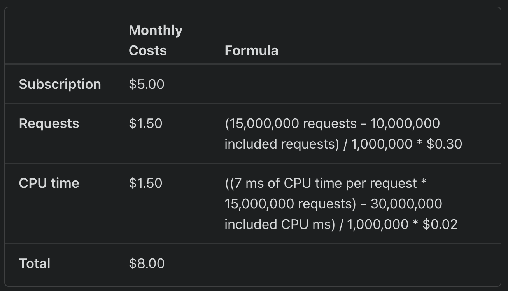
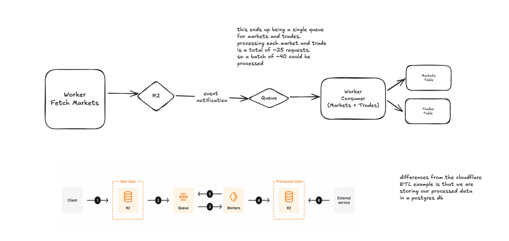

# Building a Servless ETL Solution

At [Adjacent News](https://adj.news) we are embedding prediction / event markets directly next to the news that you read. 

In order to do this we have to track a lot of markets and trades. These are available via our [data platform](https://data.adj.news) or [api](https://docs.adj.news). We initially started using a static site generator ([Observable](https://observablehq.com/framework/)) meaning all data was collected during the CI/CD build and we had no databases. This helped us get the product out quick. We will write post on this at some point. 

We started thinking through various ETL solutions to properly build a data warehouse of 250k+ markets and trade data for them. 

The goals are simple 
1. Scale to millions of markets and trades as prediction markets become more popular 
2. Make it as cheap with little need to maintain 

I stumbled upon this blog post from [cloudflare on a severless ETL solution](https://developers.cloudflare.com/reference-architecture/diagrams/serverless/serverless-etl/) using workers, queues, and cron jobs. 

The worker paid plan ($5/mo) follows a standard usage model which gives us 10,000,000 included requests and 30,000,000 included CPU time
<br /><br />

A single piece of market data looks like this 
```
{
    "ticker": "USDJPYH-24JUL2309-T163.12900",
    "event_ticker": "USDJPYH-24JUL2309",
    "market_type": "binary",
    "title": "Will the USD/JPY open price be above 163.12900 at Jul 23, 2024 at 9am EDT?",
    "subtitle": "163.130 or above",
    "yes_sub_title": "163.130 or above",
    "no_sub_title": "163.130 or above",
    "open_time": "2024-07-22T13:00:00Z",
    "close_time": "2024-07-23T13:00:00Z",
    "expected_expiration_time": "2024-07-23T13:00:00Z",
    "expiration_time": "2024-07-30T13:00:00Z",
    "latest_expiration_time": "2024-07-30T13:00:00Z",
    "settlement_timer_seconds": 3600,
    "status": "active",
    "response_price_units": "usd_cent",
    "notional_value": 100,
    "tick_size": 1,
    "yes_bid": 1,
    "yes_ask": 99,
    "no_bid": 1,
    "no_ask": 99,
    "last_price": 0,
    "previous_yes_bid": 0,
    "previous_yes_ask": 0,
    "previous_price": 0,
    "volume": 0,
    "volume_24h": 0,
    "liquidity": 396,
    "open_interest": 0,
    "result": "",
    "can_close_early": true,
    "expiration_value": "",
    "category": "Financials",
    "risk_limit_cents": 0,
    "strike_type": "greater",
    "floor_strike": 163.129,
    "rules_primary": "If the open price of the Dollar/Yen for July 23, 2024 is above 163.12900 at 9 AM EDT, then the market resolves to Yes.",
    "rules_secondary": ""
}
```

(similar for trade data). 

Its `4.0kb` and cloudflare queues let us [pass up to `128kb` per message](https://developers.cloudflare.com/queues/platform/limits/). So we can send 32 markets or trades to the queue in a single message. 

Each batch handles 10 messages by default but can go up to 100 messages or `256kb`. Since we are maxing out the mesasge size we can up our batch to process 20 messages at a time. 

These messages are sent on a cron job by our `producer` to a queue. Then a `consumer` picks it up and loads the data into our postgres database. It takes about `400ms` per batch. 

`30_000_000 included CPU time / 400 (time to process a batch) = 75,000 invocations / mo` meaning that we can process `75,000 / 30 days / 24 hrs / 60 minutes ~= 1.76 * (20*32) = 1.2k markets / minute` 

Processing 1.2k markets a minute is ok but you have to remember that is for free. Cloudflare pricing is $0.02 / 1m extra CPU time. We could double our throughput for $0.60.

> Note: We built this over the last few weeks (time stamped 7/24/2024) and are in the process of ingesting markets into the database. 

# Edit: 8.9.24 
Re-architecting this to look more like . This notablly adds 
- Storing of raw market data in R2
- Using [event notifications](https://developers.cloudflare.com/r2/buckets/event-notifications/) to add markets to a queue rather than manually adding to a queue
- Reducing to using a single queue rather than one for markets and trades 

The primary reason for switching to this was the sheer number of markets and trades and that cloudflare workers are limited to 1k subrequests (external API calls) per invocation. So rather than exceeding this, we can simply batch the tickers into a single queue to have market data and trade processing happen together.